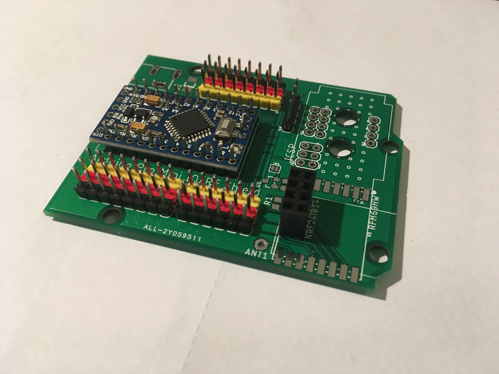
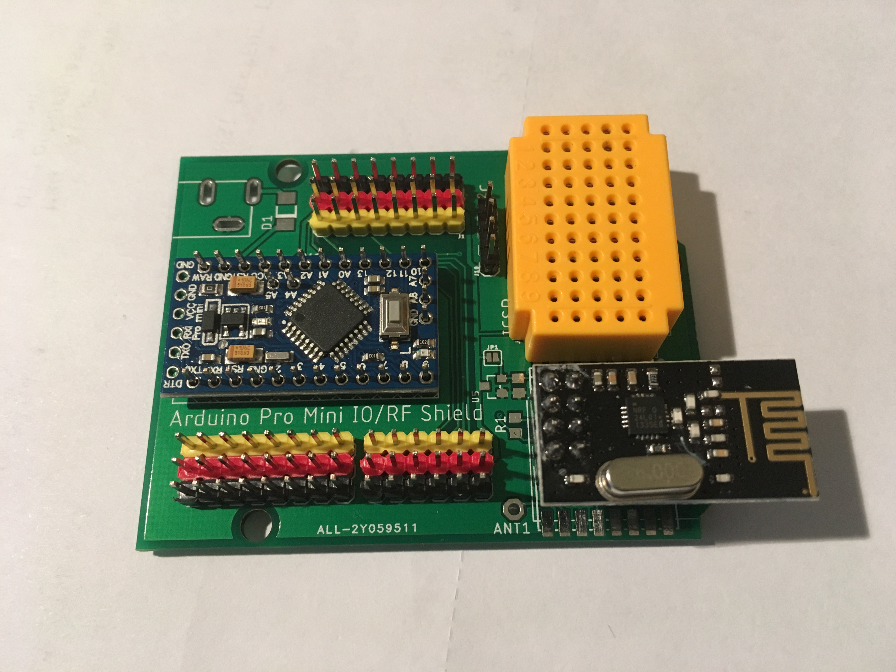
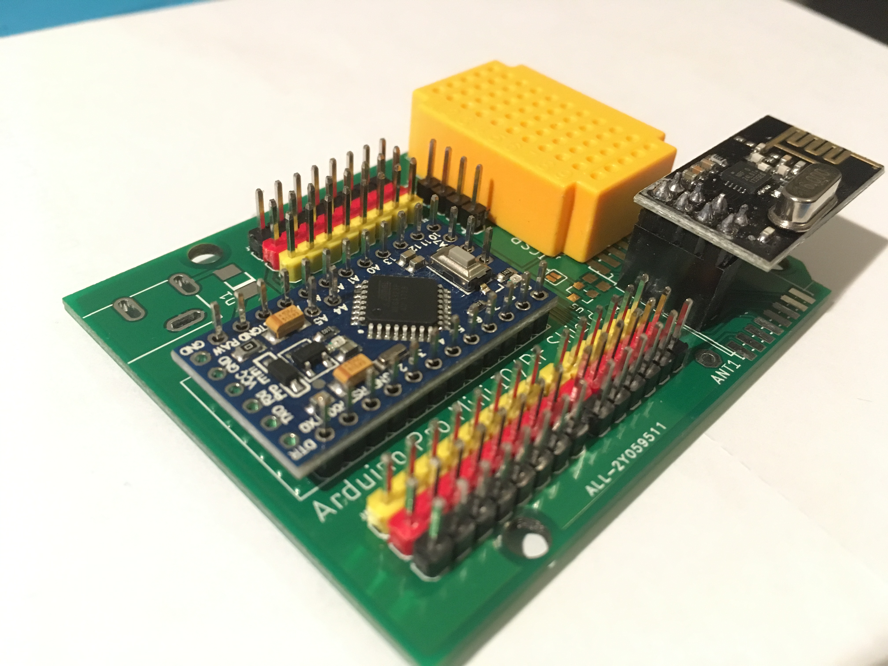
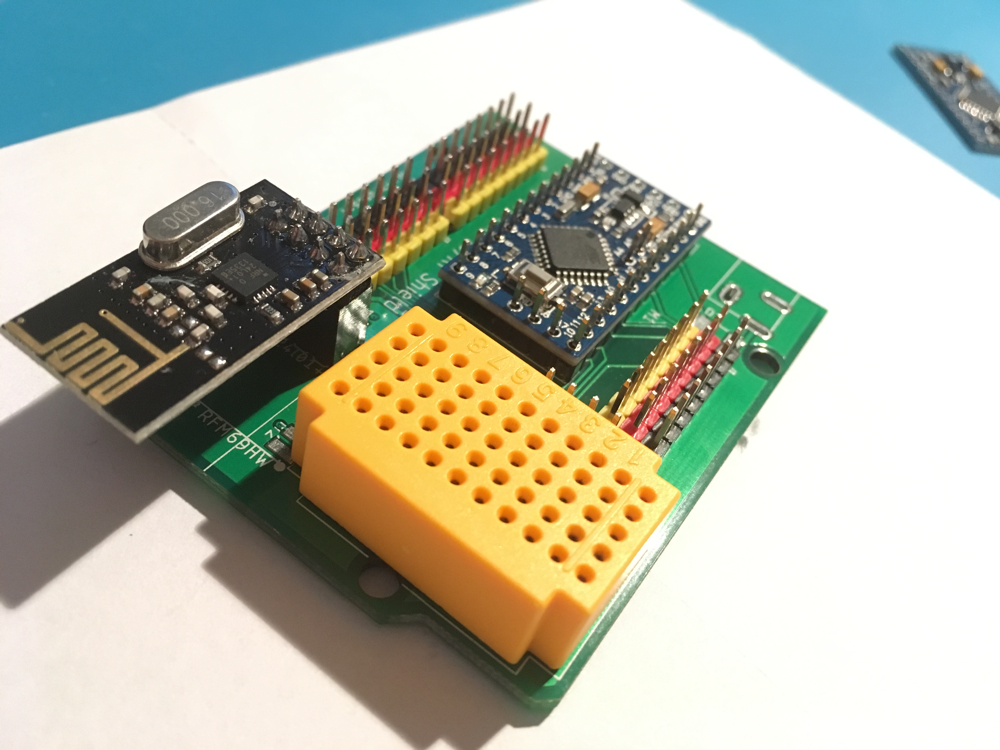
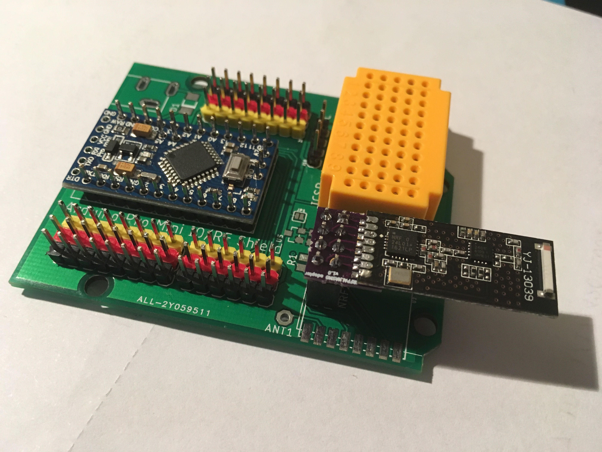
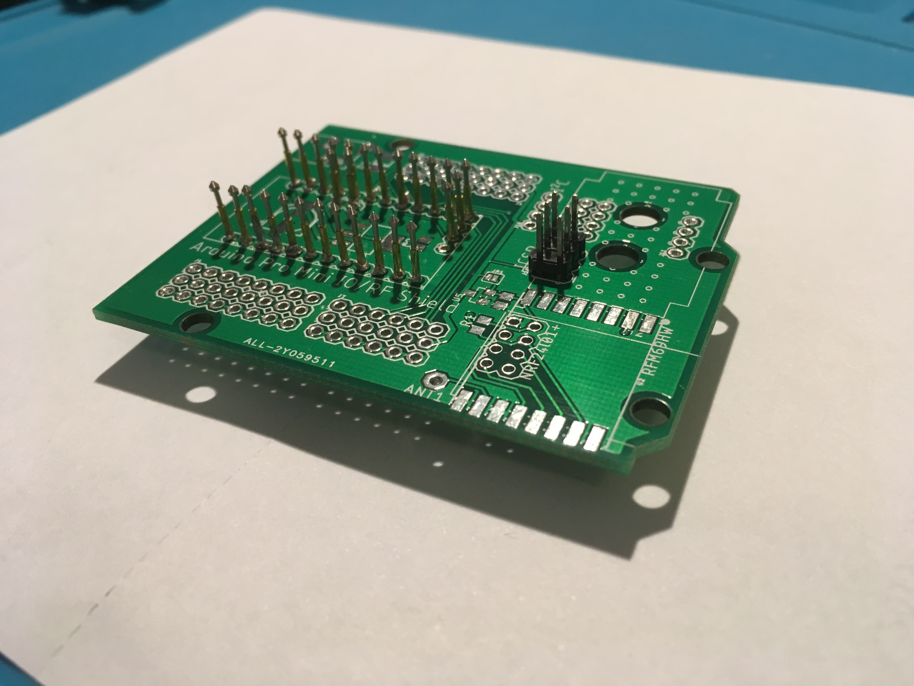
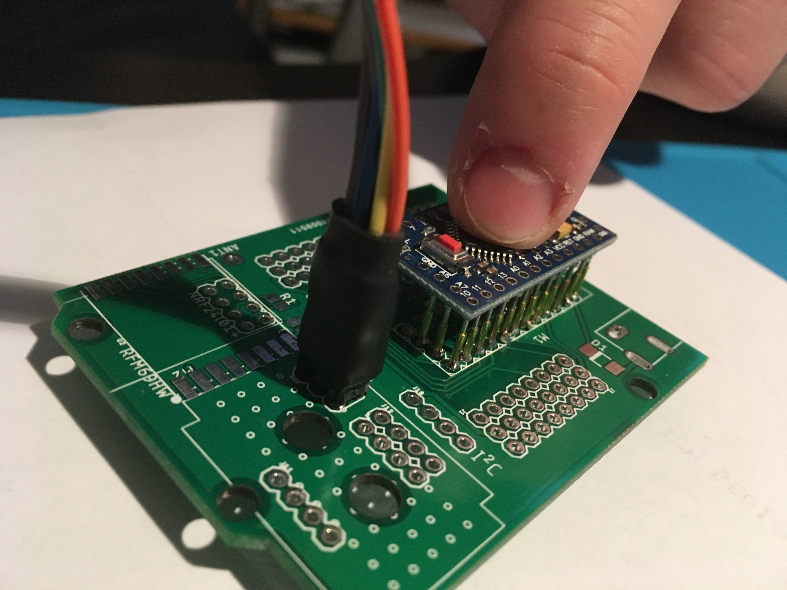
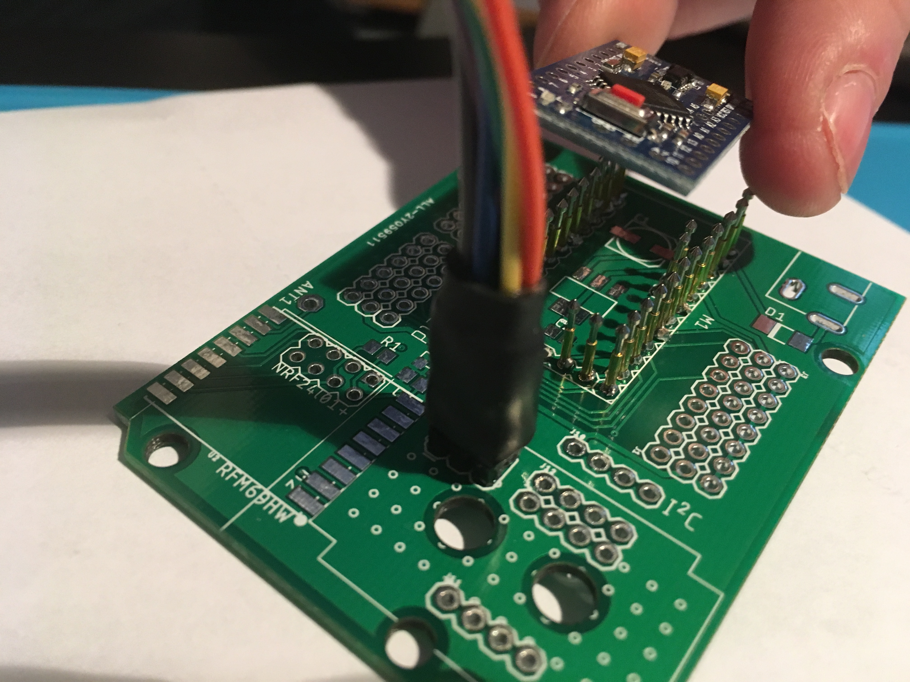
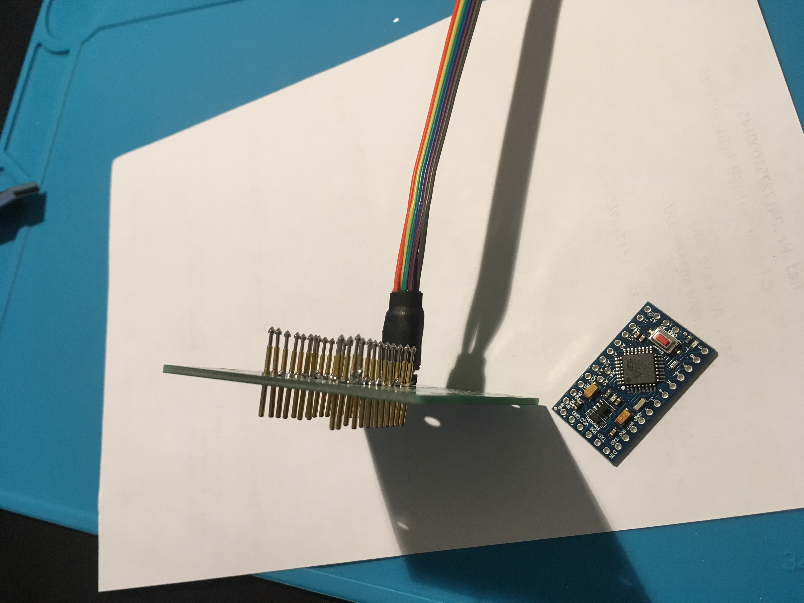

# ArduinoProMini_IOShield

Quick prototyping breakout board for Arduino Pro Mini with interface for NRF24L01+ and RFM69H wireless modules and breadboards and/or I²C connectors

## Inspiration
This board is inspired by the Arduino "Nano IO Shields" available for cheap at aliexpress (search for "arduino nano nrf24l01 board", e.g. [here](https://www.aliexpress.com/item/Free-shipping-Nano-328P-IO-wireless-sensor-expansion-board-for-XBEE-and-NRF24L01-Socket-for-arduino/32298692903.html)), which provide breakout pins, a connector for an NRF24L01+ module and an XBee module. 
As I don't have any use for the XBee socket, I simply broke off the header pins and instead taped a [tiny 5x11 pin breadboard](https://www.aliexpress.com/item/7Pcs-Mini-55-Points-Breadboard-Solderless-Prototype-Tie-point-For-Arduino-GM/32670910749.html) to the board. 

These boards are perfect for quick prototyping for the MySensors project for several reasons:
* you have the nrf24l01+ radio module already wired with their own voltage regulators and level shifters
* The board has its own power input and voltage regulators (VCC 5V will be fed to the Nano), so sensors with a high current requirement will get the power directly from the supply and not through the Arduino board.
* Each analog and digital pin has its own VCC+GND pins (usually when working with multiple sensors there is a severe shortage of VCC/GND pins for each sensor)
* The I²C and serial (RX/TX) lines are readily available as 1x4 pin headers (i.e. you don't need to know whether A4 or A5 is SDA or SCL).

The only drawback is that I use Pro Minis for most of my projects, so prototyping with a Nano means you are never testing the actual board in the prototype.

## The Board

This board provides 
* each pin of the Arduino Pro Mini as a pin header with its own VCC and GND 
* pads/connectors for a NRF24L01+ or a RFM69H wireless module (and solder pads for an XC6206 5V->3.3V regulator if required)
* I²C connector (VCC, GND, SCL, SDA)
* space for a tiny 55-pin mini breakout board or alternative three additional I²C breakout connections
* solder pads for its own AMS1117 voltage regulator
* ICSP connector to program the bootloader
* drills for the Arduino large enough to fit PogoPins, too, and
* the board outline and the holes are identical to the Arduino Uno, so Arduino holders can be used.

